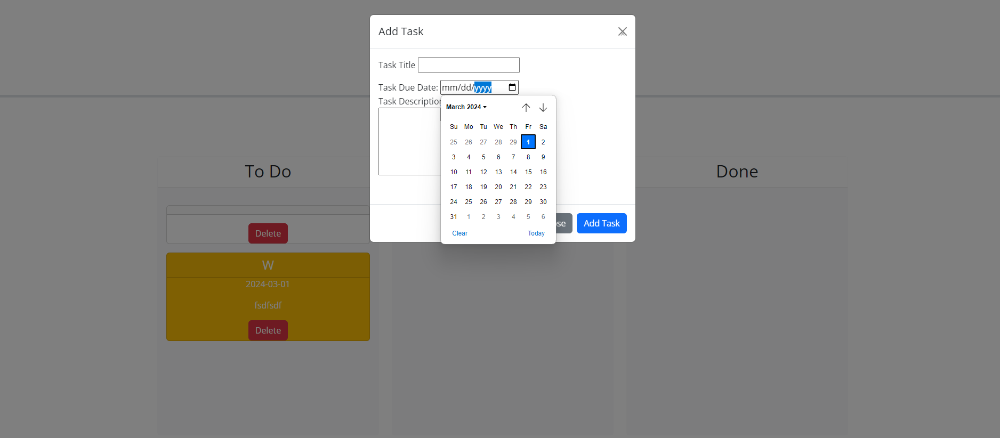

# ThirdPartyAPI-Tasks

The add task button pulls up a modal where you can add a title, due date and description of the task. Once you press the submit button "add task" it will pull up a card onto the to do list. Once it is on there based on the due date it will change colors. If it was due in a few days it will stay white and if it is due the same day it will be yellow and if it is past due it will turn red. The cards are movable to in progress or done section based on where you move it. 

img: 

deployment: https://willieyeh1.github.io/ThirdPartyAPI-Tasks/
